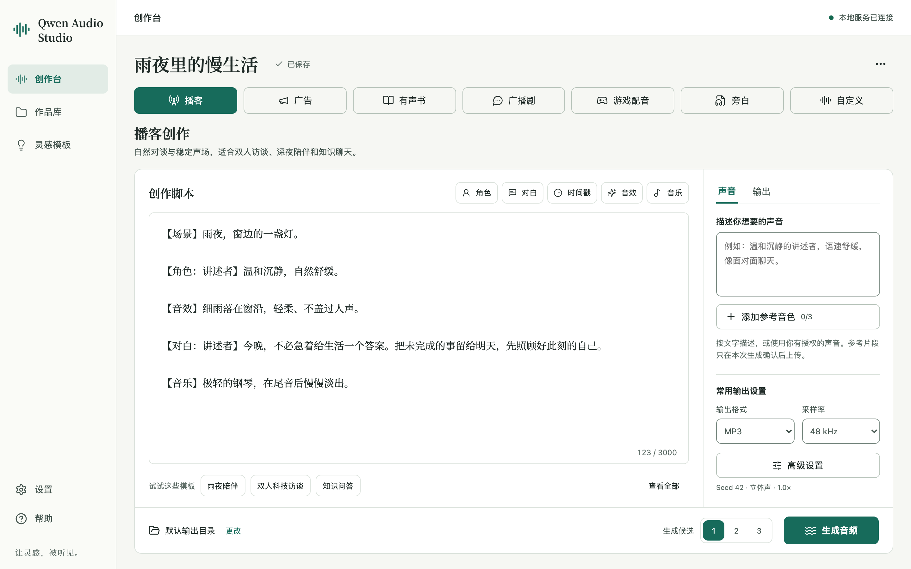
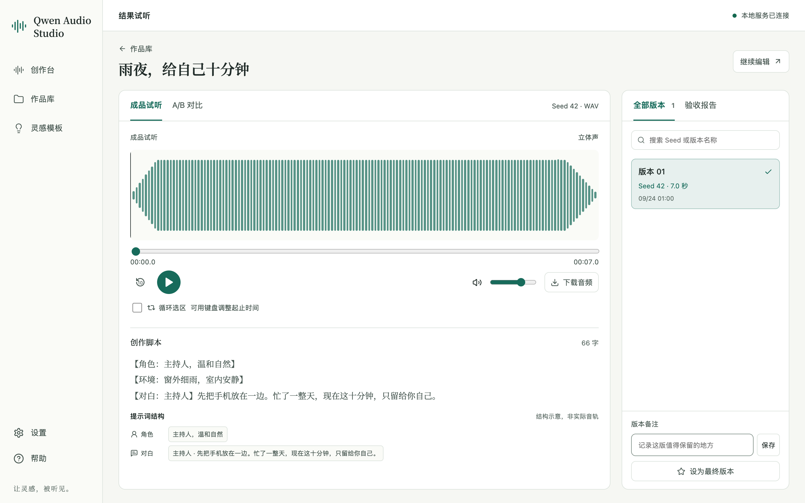

# Qwen Audio Studio

面向 `qwen-audio-3.1-tts-next` 的本地音频创作工作台。它把结构化 Prompt、参考音频预检、全量输出参数、生成队列、播放器、Seed 版本对比和双重验收放进同一个 localhost 网站。

V2 将脚本、声音与生成操作集中在桌面工作区，增加自动保存、42 个原创模板、可选输出目录、本地音色库和可恢复作品库。应用在本机运行；生成时文本及本次确认的参考音频发送至阿里云百炼。文件验收通过不能替代对台词、音色和听感的判断。



## 能力

- 播客、广告、有声书、广播剧、游戏配音、旁白、自定义 7 种创作模式
- 模式切换会联动工作流说明、专属模板和起始 Prompt；手写内容会被保留
- 角色、对白、时间戳、音效、音乐快捷标签与灵感模板
- 最多 3 条参考音频；支持本地导入、指定片段裁剪、质量提示、自愿保存音色，生成前逐次确认上传
- WAV、MP3、PCM；8kHz、16kHz、24kHz、44.1kHz、48kHz；单声道和双声道
- 音量、语速、Seed、MP3 CBR/VBR、码率/质量、AIGC 标识
- 草稿自动保存与版本冲突保护、作品库搜索/收藏/备注/回收恢复、真实版本切换、A/B 切换试听、下载与最终版本标记
- 1—3 个候选、幂等批次提交、真实生成阶段；仅未被领取的排队任务可取消
- 原生选择输出目录；当前草稿和设置默认目录分别保存，旧音频不搬迁
- `ffprobe` 元数据检查、`ffmpeg` 完整解码、SHA-256 和脱敏验收报告
- 1440×900、1280×720 桌面一屏工作台；768px 平板与 390×844 手机布局
- 思源宋体本地优先，附带重命名的 OFL 压缩网页字体，离线也能保持阅读样式



高清截图与设计对照说明见 [V2 截图目录](docs/screenshots/v2/README.md)。演示截图使用合成 QA 素材，不代表真实模型听感。字体来源及许可见 [OFL](LICENSES/SourceHanSerif-OFL.txt)，网页子集名为 Studio Han Serif。

## 使用前准备

1. macOS 13 或更高版本。
2. Python 3.11+、Node.js 20+、npm，以及 macOS Command Line Tools（用于编译启动器和文件夹选择器）。
3. 已安装 `ffmpeg`，并确保 `ffmpeg`、`ffprobe` 在 `PATH` 中。
4. 在阿里云百炼北京地域开通 `qwen-audio-3.1-tts-next`。
5. 准备北京地域 API Key。
6. 准备业务空间 ID，格式通常以 `llm-` 开头。

API Key 和业务空间 ID 请在网站的「设置」页填写。它们会直接写入 macOS 钥匙串，不需要创建 `.env` 文件。

获取方式：[API Key](https://help.aliyun.com/zh/model-studio/get-api-key)、[业务空间 ID](https://help.aliyun.com/zh/model-studio/obtain-the-app-id-and-workspace-id)。单独修改某一项会保留另一项，留空表示不修改。前端不回填真实值。「本地环境检查」不调用收费模型，也不代表账号已获得模型授权。

## 安装与启动

首次使用：

1. 双击 `安装 Qwen Audio Studio.command`。
2. 安装完成后双击 `Qwen Audio Studio.app`。
3. 浏览器会打开 `http://127.0.0.1:8765`。
4. 进入「设置」，保存 API Key 与 Workspace ID。

以后只需双击 `Qwen Audio Studio.app`。需要停止服务时，双击 `停止 Qwen Audio Studio.command`。

如果 macOS 首次阻止 `.command` 或 `.app`，请在 Finder 中右键选择「打开」。

## 参考音频边界

- 本地输入支持 WAV、MP3、OGG Opus、M4A；源文件上限 10 分钟、50 MB。
- 用户自行选择片段，不静默截取前 30 秒。准备后转换为单声道 PCM16 WAV，单条大于 0 秒、不超过 30 秒和 10 MiB；最多 3 条。
- 保存到音色库只保留本地管理副本，原录音不会覆盖。静音、低音量、削波提示为信号统计，不提供声纹相似度评分。
- 只有在生成确认框中确认具体文件后，参考音频才会发送到阿里云百炼。
- 临时参考文件不会进入 Git，也不会写进项目报告。
- 上传确认绑定项目、具体参考集合和单次批次，10 分钟有效；同批候选持有独立租约，一个任务结束不会清理另一个正在使用的片段。
- 临时素材空闲一小时后可清理；持久音色与生成作品不受缓存清理影响。

每个候选对应一次独立模型调用。重复提交相同请求 ID 返回原批次；内容变化须重新预检。已发出请求无法保证撤回或免除计费，超时及结果不确定时不自动重发收费请求；手动重试前确认可能已产生费用。完整参数见 [Next 官方 API](https://help.aliyun.com/zh/model-studio/audio-generation-api)。


## 安全设计

- 服务只监听 `127.0.0.1`。
- 非本地 Host 会被拒绝。
- 修改类请求需要会话级 CSRF Token。
- API Key 与 Workspace ID 通过 macOS `Security.framework` 读写钥匙串，凭据不会进入命令参数。
- 前端只接收“已配置/未配置”状态。
- 日志和持久化错误会过滤 API Key、Workspace ID、Authorization 与音频 Data URI。
- 媒体文件只能通过内部登记的资产 ID 读取，路径穿越会被拒绝。

## 开发

```bash
python3 -m venv .venv
.venv/bin/pip install -r backend/requirements.txt
npm --prefix frontend install
npm --prefix frontend run build
PYTHONPATH=backend .venv/bin/uvicorn app.main:create_app --factory --host 127.0.0.1 --port 8765
```

运行测试：

```bash
cd backend && ../.venv/bin/python -m unittest discover -s tests -v
cd .. && npm test
python3 -m unittest discover tests -v
npm run build
```

当前后端回归包含草稿、目录、裁剪、共享引用租约、单次授权、并发幂等、排队取消、回收恢复和安全边界。最新数量与浏览器证据以 [QA.md](QA.md) 为准，旧版测试数量不作为 V2 通过证据。

浏览器验收使用隔离服务，避免操作真实作品或调用收费模型：

```bash
QA_DATA_DIR=$(mktemp -d /private/tmp/qwen-studio-qa-XXXXXX)
PYTHONPATH=backend .venv/bin/python backend/qa_app.py --data-root "$QA_DATA_DIR" --port 8766
```

该服务只接受专用临时目录，使用假凭据和六条合成测试音频，不读取系统钥匙串、不调用模型。合成信号不能作为模型效果展示。Ctrl+C 停止服务。

## 数据位置

- 项目、任务与脱敏报告：`~/Library/Application Support/Qwen Audio Studio/`
- 生成音频：应用数据目录下的 `outputs/`
- 凭据：macOS 钥匙串

源码中不包含任何真实 API Key、Workspace ID、个人参考音频或真实生成报告。

V2 元数据保存于 `studio.sqlite3`，持久音色位于 `voices/`，临时工作副本位于 `cache/`。选择其他输出目录后，新任务按提交时的固定位置写入音频、`prompt.txt`、`report.json`、`report.md`；修改默认目录不移动旧文件。

作品回收支持只移除记录，或连同应用拥有的生成文件一起移入回收站，均可恢复。恢复遇到同名文件会另取名称，不覆盖原文件。没有自动清空和永久删除操作。

## 升级、备份与回滚

升级前等待任务结束并停止旧服务，用 Finder 复制整个应用数据目录作为备份，自选输出目录也分别备份。不要同时运行两个版本写入同一数据目录。

首次 V2 初始化校验旧 `projects/`、`jobs/`、`assets.json`，备份到 `backups/` 后事务导入 SQLite，保留原 ID、音频路径和源 JSON。损坏源数据会阻止切换，重复初始化不重复导入。旧排队/运行任务转为「已中断」，不会自动再次调用；旧上传确认不作为升级后的永久授权。

回滚时先停止 V2，另备份当前完整数据，再运行旧版读取原 JSON。V2 新增音频仍保留在磁盘，但旧版无法自动识别新增元数据。不要删除 SQLite、音频或新目录来尝试回滚。

## 技术结构

- 前端：React 18、TypeScript、Vite、React Router、TanStack Query
- 后端：FastAPI、Pydantic、Uvicorn
- 音频：内置 Qwen Audio Next 核心适配器、ffmpeg、ffprobe
- 桌面入口：macOS `.app` 启动包 + 可读的安装/启动/停止脚本

模型固定为 `qwen-audio-3.1-tts-next`。项目没有引入 Flash 系统音色流程。
