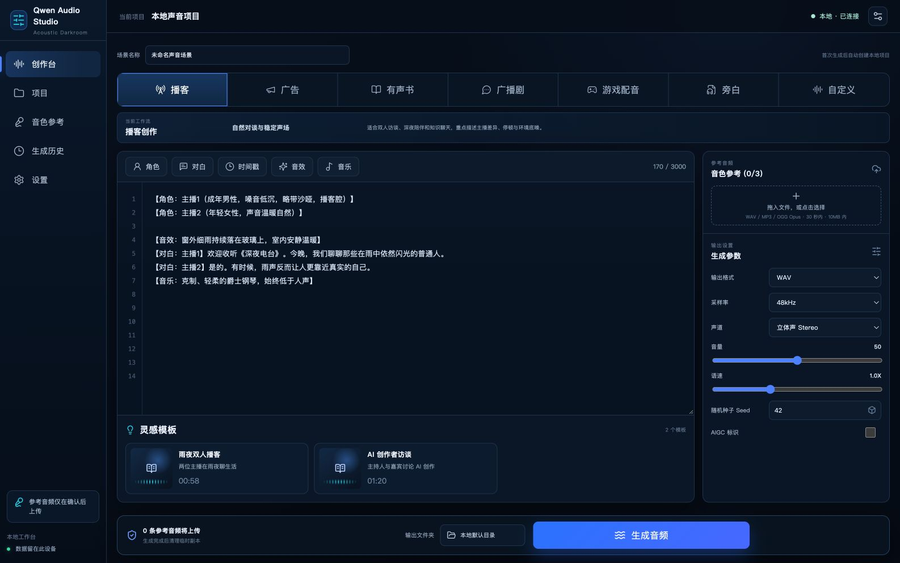
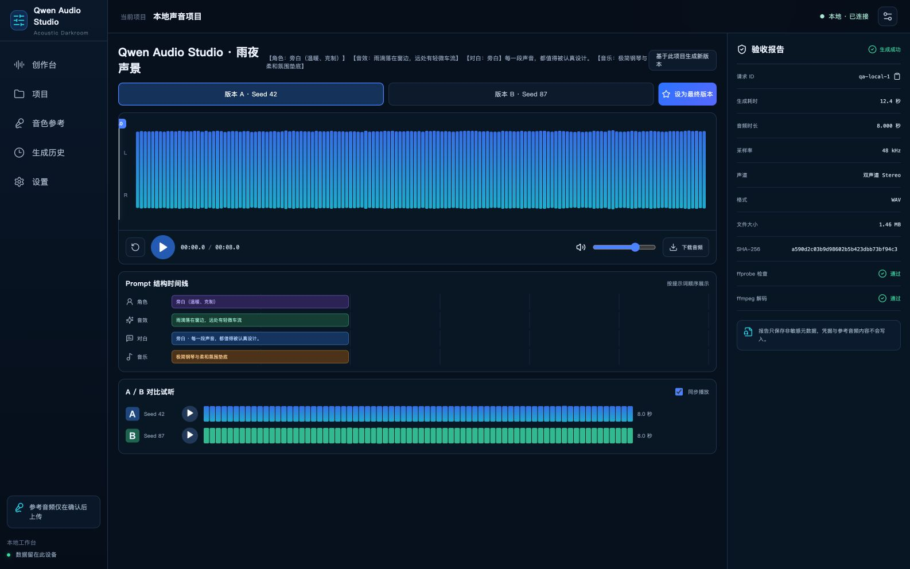
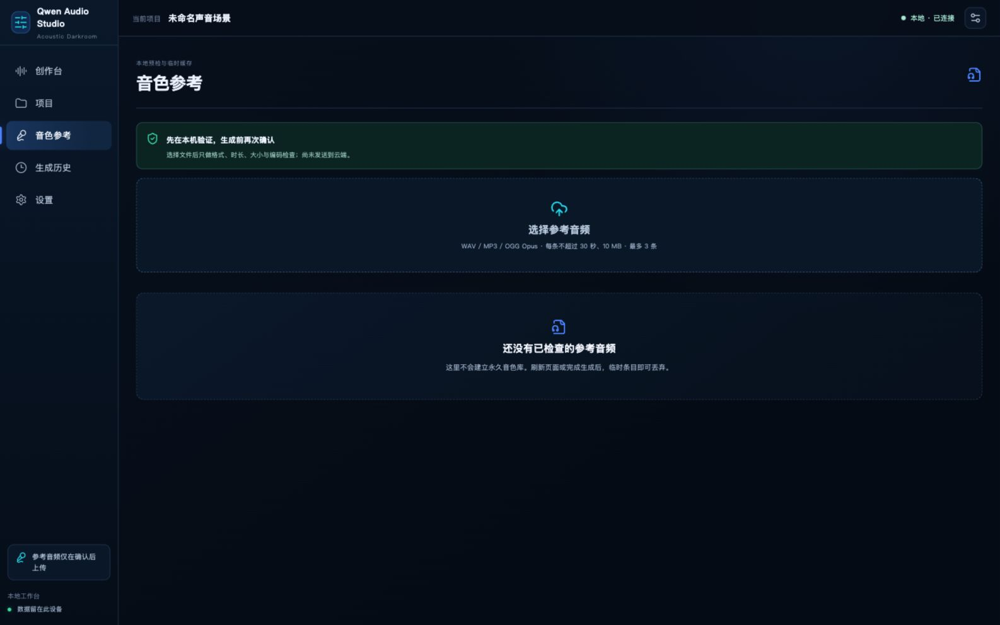

# Qwen Audio Studio

面向 `qwen-audio-3.1-tts-next` 的本地音频创作工作台。它把结构化 Prompt、参考音频预检、全量输出参数、生成队列、播放器、Seed 版本对比和双重验收放进同一个 localhost 网站。



## 能力

- 播客、广告、有声书、广播剧、游戏配音、旁白、自定义 7 种创作模式
- 模式切换会联动工作流说明、专属模板和起始 Prompt；手写内容会被保留
- 角色、对白、时间戳、音效、音乐快捷标签与灵感模板
- 最多 3 条参考音频；本地检查格式、编码、时长和大小，生成前明确确认上传
- WAV、MP3、PCM；8kHz、16kHz、24kHz、44.1kHz、48kHz；单声道和双声道
- 音量、语速、Seed、MP3 CBR/VBR、码率/质量、AIGC 标识
- 项目续作与生成历史、失败重试、真实版本切换、A/B 同步试听、下载与最终版本标记
- `ffprobe` 元数据检查、`ffmpeg` 完整解码、SHA-256 和脱敏验收报告
- 1586×992 桌面工作台与 390×844 窄屏布局



## 使用前准备

1. macOS 13 或更高版本。
2. Python 3.9+、Node.js 20+、npm，以及 macOS Command Line Tools（用于编译轻量启动器）。
3. 已安装 `ffmpeg`，并确保 `ffmpeg`、`ffprobe` 在 `PATH` 中。
4. 在阿里云百炼北京地域开通 `qwen-audio-3.1-tts-next`。
5. 准备北京地域 API Key。
6. 准备业务空间 ID，格式通常以 `llm-` 开头。

API Key 和业务空间 ID 请在网站的「设置」页填写。它们会直接写入 macOS 钥匙串，不需要创建 `.env` 文件。

## 安装与启动

首次使用：

1. 双击 `安装 Qwen Audio Studio.command`。
2. 安装完成后双击 `Qwen Audio Studio.app`。
3. 浏览器会打开 `http://127.0.0.1:8765`。
4. 进入「设置」，保存 API Key 与 Workspace ID。

以后只需双击 `Qwen Audio Studio.app`。需要停止服务时，双击 `停止 Qwen Audio Studio.command`。

如果 macOS 首次阻止 `.command` 或 `.app`，请在 Finder 中右键选择「打开」。

## 参考音频边界

- 支持 WAV、MP3、OGG Opus。
- 单条不超过 30 秒、10 MB；最多 3 条。
- 选择文件后先在本机执行 ffprobe 检查。
- 只有在生成确认框中确认具体文件后，参考音频才会发送到阿里云百炼。
- 临时参考文件不会进入 Git，也不会写进项目报告。



## 安全设计

- 服务只监听 `127.0.0.1`。
- 非本地 Host 会被拒绝。
- 修改类请求需要会话级 CSRF Token。
- API Key 与 Workspace ID 通过 macOS `Security.framework` 读写钥匙串，凭据不会进入命令参数。
- 前端只接收“已配置/未配置”状态。
- 日志和持久化错误会过滤 API Key、Workspace ID、Authorization 与音频 Data URI。
- 媒体文件只能通过内部登记的资产 ID 读取，路径穿越会被拒绝。

## 开发

```bash
python3 -m venv .venv
.venv/bin/pip install -r backend/requirements.txt
npm --prefix frontend install
npm --prefix frontend run build
PYTHONPATH=backend .venv/bin/uvicorn app.main:create_app --factory --host 127.0.0.1 --port 8765
```

运行测试：

```bash
cd backend && ../.venv/bin/python -m unittest discover -s tests -v
cd .. && npm test
python3 -m unittest discover tests -v
npm run build
```

当前回归基线：后端 26 项、前端 26 项、启动器 4 项。

## 数据位置

- 项目、任务与脱敏报告：`~/Library/Application Support/Qwen Audio Studio/`
- 生成音频：应用数据目录下的 `outputs/`
- 凭据：macOS 钥匙串

源码中不包含任何真实 API Key、Workspace ID、个人参考音频或真实生成报告。

## 技术结构

- 前端：React 18、TypeScript、Vite、React Router、TanStack Query
- 后端：FastAPI、Pydantic、Uvicorn
- 音频：内置 Qwen Audio Next 核心适配器、ffmpeg、ffprobe
- 桌面入口：macOS `.app` 启动包 + 可读的安装/启动/停止脚本

模型固定为 `qwen-audio-3.1-tts-next`。项目没有引入 Flash 系统音色流程。
